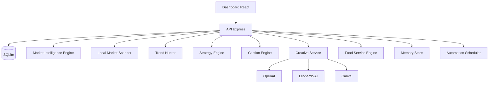

# IMPLEMENTACAO REALIZADA

Data: 2026-06-19

## 1) Entregas concluidas

- Auditoria tecnica completa (`AUDITORIA_COMPLETA.md`)
- Plataforma backend real com API REST + SQLite
- Camada de coleta de mercado por links reais
- Scanner de concorrencia local com comparacao
- Trend Hunter com captura automatizada
- Strategy Engine orientado por historico
- Modulo de geracao de criativos com provedores reais
- Gerador de legendas estruturado
- Sistema de memoria persistente
- Sistema de automacao (diario, semanal, mensal)
- Modulo de inteligencia para food service
- Dashboard React conectado em API (nao estatico)

## 2) Arquivos criados (principais)

### Auditoria
- `AUDITORIA_COMPLETA.md`

### Banco
- `database/README.md`
- `platform/api/src/db/migrations/001_init.sql`
- `platform/api/src/db/client.js`
- `platform/api/src/db/runMigrations.js`
- `platform/api/src/db/repository.js`

### API
- `platform/api/package.json`
- `platform/api/.env.example`
- `platform/api/src/server.js`
- `platform/api/src/config/env.js`

### Coleta e inteligencia
- `platform/api/src/modules/collection/marketIntelligenceEngine.js`
- `platform/api/src/modules/collection/localMarketScanner.js`
- `platform/api/src/modules/collection/trendHunter.js`
- `platform/api/src/modules/collection/htmlMenuParser.js`

### Estrategia, memoria, automacao, food
- `platform/api/src/modules/strategies/strategyEngine.js`
- `platform/api/src/modules/memory/memoryStore.js`
- `platform/api/src/modules/automation/scheduler.js`
- `platform/api/src/modules/food/foodServiceEngine.js`

### Conteudo e criativos
- `platform/api/src/modules/content/captionEngine.js`
- `platform/api/src/modules/creative/creativeService.js`

### Integracoes de imagem
- `integrations/image-generation/README.md`
- `platform/api/src/integrations/image-generation/index.js`
- `platform/api/src/integrations/image-generation/providers/openaiProvider.js`
- `platform/api/src/integrations/image-generation/providers/leonardoProvider.js`
- `platform/api/src/integrations/image-generation/providers/canvaProvider.js`

### Rotas REST
- `platform/api/src/routes/health.routes.js`
- `platform/api/src/routes/companies.routes.js`
- `platform/api/src/routes/intelligence.routes.js`
- `platform/api/src/routes/strategy.routes.js`
- `platform/api/src/routes/campaigns.routes.js`
- `platform/api/src/routes/content.routes.js`
- `platform/api/src/routes/creative.routes.js`
- `platform/api/src/routes/memory.routes.js`
- `platform/api/src/routes/dashboard.routes.js`
- `platform/api/src/routes/automation.routes.js`

### Dashboard React (centro de inteligencia)
- `platform/dashboard-app/package.json`
- `platform/dashboard-app/index.html`
- `platform/dashboard-app/vite.config.js`
- `platform/dashboard-app/src/main.jsx`
- `platform/dashboard-app/src/App.jsx`
- `platform/dashboard-app/src/api.js`
- `platform/dashboard-app/src/styles.css`

## 3) Funcionalidades novas

- Coleta real de cardapio por URL (HTML scraping)
- Snapshot de mercado salvo no SQLite
- Comparativo meu cardapio x concorrencia
- Captura de tendencias e armazenamento historico
- Geracao automatica de estrategia com base no historico
- Geração de legenda curta/media/longa + CTA + hashtags
- Integracao com OpenAI/Leonardo/Canva via camada unica
- Registro de memoria de analises e estrategias
- Jobs automatizados para rotina operacional

## 4) Arquitetura final

## 5) Configuracao de ambiente

1. API
- copiar `platform/api/.env.example` para `platform/api/.env`
- configurar chaves das APIs externas
- instalar dependencias e iniciar API

2. Dashboard
- instalar dependencias em `platform/dashboard-app`
- iniciar Vite

## 6) Proximos passos recomendados

1. Adicionar autenticacao e controle de acesso por usuario
2. Implementar filas para coletas longas e resiliencia de integracoes
3. Criar parser dedicado por plataforma (Anota, iFood, Mais Delivery)
4. Adicionar testes automatizados e observabilidade
5. Evoluir de SQLite para Postgres em ambiente de maior volume
